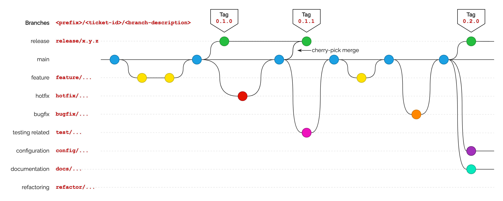

# Our Git workflow 

We will use a Git workflow based on *Trunk-Based Development* (*TBD*). This type of development (*and consequently the workflow itself*) is especially adapted for development with CI and CD. Surely there are many different variants of workflows that are based on TBD, but the one we will use is pretty standard. The great thing with a TBD workflow is that it focuses on keeping things simple and effective, so it is very intuitive with some minor details. In the figure below is an illustration of how the workflow could look like for some project, and afterwards it will be explained with a series of sections:



## What characterises TBD?

Trunk-based development is a software development approach where all developers work on a single branch of the codebase, commonly known as the "trunk" which is the `main` branch. Since everyone works practically on the same branch, changes are integrated and committed to the trunk frequently. This encourages small, incremental updates rather than large, infrequent ones. As a result, it reduces the complexity and risk associated with merging divergent code from different branches back into the main codebase.

This approach promotes continuous integration, as developers are encouraged to integrate their changes into the trunk regularly, ideally several times a day. This frequent integration helps in identifying and fixing integration issues early and reduces the "integration hell" that can occur in branch-based development models. This development approach strives to keep the "trunk" production ready at all times.

## How does branching work in TBD?

There is basically two branching strategies when it comes to TBD. One is to actually not have any branches at all, but just push to `main`? How is that not stupid you ask? Well, TBD solves the obvious chaos of this with CI. By implementing pipelines and safeguards, it is won't be possible to push anything that isn't thourogly tested and since commits are kept very small, the actual change won't affect the team at all.

However, another option is to branch from `main` into what are called *short-lived feature branches*. In practice, they don't actually always have to be *feature* branches (*i.e., branches implementing a new feature*), the main point is that any branch from `main` must to be *short-lived*. This is the option we will choose, because this option encourages code reviewing. That isn't to say that the first option is worse, but let's not get carried away. In the next section it is explained how code reviewing works in most development approaches

## Code reviewing with Pull Requests (PRs)

After you have branched from `main` and made the inteded changes or contributions to the project, you then want it to get incorporated into `main`, the "trunk" in our case. Therefore, you want to:

***Request** another or other team members to **pull** your branch into `main`*

That is how it worked historically, so it was called *pull request*. However, nowadays it makes more sense to say that one requests another team member to merge one's branch into `main`, due to today's methods. In GitHub it is called Pull Request but in GitLab, an alternative to GitHub, it is actually called Merge Request!

More about how Pull Requests work in practice is explained on another page. Now that we have gone through what characterises TBD and that we will use the short-lived branching option let's continue to understand how we are practially implementing a branching model for TBD.

## Branch names

When branching from `main`, the name of the branch should follow the following structure:

```
<prefix>/<ticket-id>/<branch-name>
```

It doesn't actually technically matter what a branch name is called, it is just for organisation:

- `<prefix>` denotes what type of branch it is. Does it implement a new feature? Does it fixes a bug? Is it a release branch (*more about that later*)? The prefixes need to be pre-defined, as in you should choose any of the possible prefixes in the project. 
- `<ticket-id>` is some sort of identifier for the issue that the branch is addressing. With "issue" I mean for example a GitHub issue or any other ticket in other systems, such as a Jira ticket.
- `<branch-description>` is simply a short description of the what the branch is specifically about.

### Prefixes

As you can see in the image, there are multiple different prefixes and the following prefixes are basically always included in all projects:

- `feature` - For branches that implements a new feature or new functionality.
- `hotfix` - For branches that fixes a critical bug in a release (more on this later).
- `bugfix` or `fix` - For branches that fixes a bug.
- `release` - This one isn't actually always used, but depending on the branching model it is required.

In addition to this, the following prefixes are useful:

- `test` or `testing` - Might be useful but can also be unnecessary depending on the development methodology. For branches that implements any test related work (*e.g., unit tests*).
- `config` – For branches that is modifying or adding config files.
- `docs` – For branches that is modifying or adding documentation.
- `refactor` – For branches that refactors the code (e.g., renaming things).

### Ticket identifier

The ticket identifier is decided by the issue/ticket system that one is using and is simply just a copy of it.

### Branch description

This is a short description in kebab case (i.e., words separated with hyphens "`-`"). A branch name could be for example `create-back-button`

### A full branch name

A full branch name could for example be: `feature/42/create-back-button`.

## Release management

This part might be irrelevant for this course, but it is still good to know. In this workflow, production code is release by creating a *release branch* from the `main` named in the following format: `release/x.y.z` (more about what the `x.y.z` means farther down).

After the release branch has been created, a release is made on GitHub by also creating a tag (*a Git functionality that is snapshot of the current state of the commit*) named after the version of the release and connecting the tag to the release. To be clear, this is a GitHub functionality and is how a release is made in GitHub.

After this, the release branch can be safely deleted after some time. However, a critical bug might be discovered in the release and a fix is needed (*so-called "hotfix"*). This critical bug will also be present in the "trunk" (*i.e., `main` branch*), so a hotfix branch is created from the main and the hotfix is implemented. After it has been implemented, that specific implementation (*i.e., that specific commit*) is then merged to the release branch. Such a merge is called a *cherry-pick merge*. After the cherry-pick merge is done and the hotfix is added to the release branch, then another release is created with another tag.

### The version number

The `x.y.z` part is the version number of the release as described by the *semantic versioning* standard. A short explanation:

- `x` - this part tracks the major version of the release. If this is increased, then it means that the software has structurally changed and any integrations will have incompatibilities.
- `y` - this part tracks the minor version of the release. If this is increased, then it means that functionality has been added but with backwards compatibility.
- `z` - this part tracks the patch version of the release. If this is increased, then it means that a backwards compatible bug fix has been implemented.